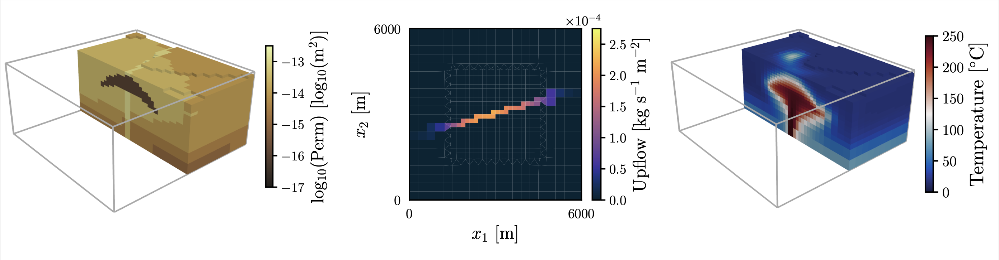

# Data Space Inversion for Efficient Predictions and Uncertainty Quantification for Geothermal Models

[](https://doi.org/10.5281/zenodo.12193947)



This repository contains code written as part of the paper "Data Space Inversion for Efficient Predictions and Uncertainty Quantification for Geothermal Models", by Alex de Beer, Andrew Power, Daniel Wong, Ken Dekkers, Michael Gravatt, John P. O'Sullivan, Michael J. O'Sullivan, Oliver J. Maclaren, and Ruanui Nicholson.

## Running Experiments

### Simplified Two-Dimensional Reservoir Model

Code to run the experiments for the simplified two-dimensional reservoir model is contained in the `Model2D` folder. The model is written in Julia 1.9. After installing Julia and cloning this repository, open this folder and run
```
using Pkg
Pkg.activate(".")
Pkg.instantiate()
```
to install the project dependencies. You will then be able to run any of the scripts at the top level of the folder.

To compute a full characterisation of the posterior using MCMC, run `run_pcn.jl` (this will take several days on a desktop computer). To compute a local linearisation about the MAP estimate, run `run_lmap.jl`, to run the DSI algorithm, run `run_dsi.jl`, and to sample from the prior, run `run_pri.jl`. To carry out a comparison of the performance of DSI with varying sample sizes, run `run_dsi_comparison.jl`.

### Three-Dimensional Reservoir Model

Code to run the experiments for the three-dimensional reservoir model is contained in the `Model3D` folder. The scripts in this folder require Python >= 3.8 to run. After installing Python and cloning this repository, open this folder and run
```
python3.8 -m pip install -r requirements.txt
```
to install the project dependencies. You will also need to install the Waiwera geothermal simulator if you would like to run any simulations; for further information, consult the [Waiwera website](https://waiwera.github.io). 

 - To generate the ensemble of reservoir models used to estimate the covariance matrices required as part of the DSI algorithm, run `generate_ensemble.py`. The resulting simulation input files can then be run [locally using Docker](https://waiwera.readthedocs.io/en/latest/run.html) (though this is likely to take a while), or on a high-performance computing cluster which contains a Waiwera build. We have included the jobfile we used to run the simulations on the Maui cluster operated by NeSI (New Zealand eScience Infrastructure).
 - To gather the statistics of the quantities of interest, run `process_output.py`. This will ignore the results associated with failed simulations. 
 - To run the DSI algorithm to approximate the posterior predictive distribution of the quantities of interest, run `run_dsi.py` or `run_dsi_trans.py` (which will run the DSI algorithm with a transformation applied to the pressure predictions).

The `models` folder contains the meshes for the fine and coarse models used in the paper, and the input and output files for the true system. Files related to the true system are also located in `data/truth`. 

**Note**: when the code is first run, the covariance matrices (and their Cholesky factors) of the GRFs used as part of the prior parametrisation will be computed. This is likely to take several minutes. You may also need to create folders for these files (`data/grf_2d` and `data/grf_3d`).

**Note**: we have provided files containing the predictive quantites of interest associated with the simulations from the prior produced using `process_output.py` (these are located in the `data` folder), so if you are only looking to reproduce the DSI analysis from the paper, you do not need to run the full set of simulations.

## Generating Figures

Each model folder contains a script called `plotting.py`, which can be run to reproduce the figures from the paper associated with the model. Running these script requires Python >= 3.8, and a subset of the dependencies required to run the experiments for the three-dimensional reservoir model. The figures are saved to the `figures` directory, and have the same numbering as in the manuscript. Some figures are composed of multiple parts; in these instances, the parts that make up the figure as saved as `fig1a.pdf`, `fig1b.pdf`, etc. 

## Issues

If you have any questions about the code or the paper, please open an [issue](https://github.com/alexgdebeer/GeothermalDSI/issues).